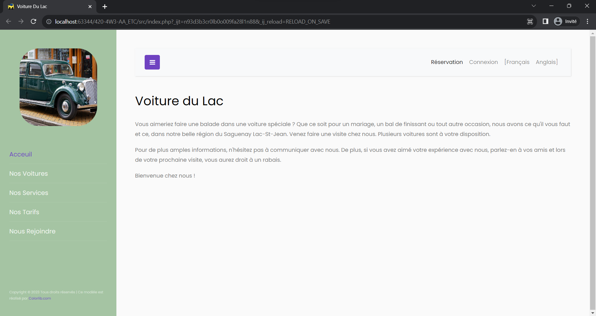

# VoitureDuLac
<mark>NOT FINALIZED<mark>

## Overview
VoitureDuLac is a comprehensive web application designed for managing and renting a fleet of luxurious cars. Developed with a focus on providing a seamless experience, the project incorporates main web technologies to create a dynamic and user-friendly platform. The site caters to both English and French speakers, offering an internationalized experience.
> Final Examination for the Transactional Web Application Development Course (420-4W3-AA / Winter 2023). Conditions: 6 sessions of 2 hours each for completion.

## Table of Contents
- [Features](#features)
- [Technologies Used](#technologies-used)
- [Demo](#demo)
- [Getting Started](#getting-started)
- [Database Configuration](#database-configuration)
- [License](#license)

## Features

- **Multilingual Support**: The website is available in both English and French, catering to a diverse audience.

- **Admin Panel**: Manage your car listings, reservations, clients, and invoices efficiently through the admin panel.

- **Database Storage**: All essential data, including cars, clients, reservations, and invoices, is securely stored in the MySQL database.

## Technologies Used

- **HTML**: The backbone of the project, providing the structure for web pages and content.

- **CSS**: Responsible for styling and ensuring a visually appealing and responsive design for an optimal user experience.

- **JavaScript (JS)**: Enhances interactivity and dynamic behavior on the client side, improving user engagement.

- **PHP**: The server-side scripting language that enables the handling of dynamic content, interactions with the database, and server-side processing.

- **MySQL**: A powerful relational database management system used to store and manage data related to cars, clients, reservations, and invoices.

- **Bootstrap**: A popular front-end framework that streamlines the design and development process, providing a responsive and visually consistent user interface.

- **PhpStorm**: An Integrated Development Environment (IDE) for PHP, offering powerful coding assistance, productivity features, and time-saving tools.

- **DataGrip**: A JetBrains IDE for SQL that provides a comprehensive environment for database development, management, and query execution.

- **cPanel**: A web-based control panel facilitating the management of website hosting, including server configurations, file management, and database administration.

## Demo

## Getting Started

1. Clone the repository: `git clone https://github.com/MaxenceGuidezCollege/VoitureDuLac.git`
2. Import the database schema using the provided SQL scripts.
3. Configure your MySQL server details in the application.
4. Explore and enjoy the world of luxury cars with VoitureDuLac!

## Database Configuration

- **MySQL Server**
    - Host: localhost
    - Username: root

- **Database Name**: voitureDuLac

### Tables

Table: voiture

| Column         | Type         | Description                    |
|----------------|--------------|--------------------------------|
| idVoiture      | SMALLINT     | Unique identifier for each car |
| nomVoiture     | VARCHAR(30)  | Car model name                 |
| marque         | VARCHAR(25)  | Car brand                      |
| annee          | SMALLINT     | Year of manufacture            |
| km             | INT          | Mileage of the car             |
| description_fr | VARCHAR(150) | Description in French          |
| description_en | VARCHAR(150) | Description in English         |

Table: client

| Column    | Type        | Description                       |
|-----------|-------------|-----------------------------------|
| idClient  | SMALLINT    | Unique identifier for each client |
| prenom    | VARCHAR(25) | First name of the client          |
| nom       | VARCHAR(25) | Last name of the client           |
| courriel  | VARCHAR(50) | Email address of the client       |
| telephone | VARCHAR(10) | Phone number of the client        |

Table: reservation

| Column        | Type     | Description                                               |
|---------------|----------|-----------------------------------------------------------|
| idReservation | SMALLINT | Unique identifier for each reservation                    |
| noVoiture     | SMALLINT | Reference to the car being reserved                       |
| noClient      | SMALLINT | Reference to the client making the reservation            |
| dateDebut     | DATE     | Start date of the reservation                             |
| dateFin       | DATE     | End date of the reservation                               |
| statut        | TINYINT  | Status of the reservation (0: Active, 1: Completed, etc.) |

Table: facture

| Column        | Type       | Description                                              |
|---------------|------------|----------------------------------------------------------|
| idFacture     | SMALLINT   | Unique identifier for each invoice                       |
| noReservation | SMALLINT   | Reference to the reservation associated with the invoice |
| noClient      | SMALLINT   | Reference to the client being billed                     |
| noVoiture     | SMALLINT   | Reference to the car rented                              |
| dateDebut     | DATE       | Start date of the reservation                            |
| dateFin       | DATE       | End date of the reservation                              |
| kmDebut       | INT        | Mileage at the start of the reservation                  |
| kmFin         | INT        | Mileage at the end of the reservation                    |
| montant       | FLOAT      | Total amount of the invoice                              |
| assurance     | TINYINT(1) | Insurance status (0: No, 1: Yes)                         |

Table: usager

| Column   | Type         | Description                            |
|----------|--------------|----------------------------------------|
| idUsager | SMALLINT     | Unique identifier for each user        |
| courriel | VARCHAR(50)  | Email address of the user (admin)      |
| motPasse | VARCHAR(255) | Encrypted password of the user (admin) |

## License

This project is licensed under the MIT License - see the [LICENSE.md](LICENSE.md) file for details.
